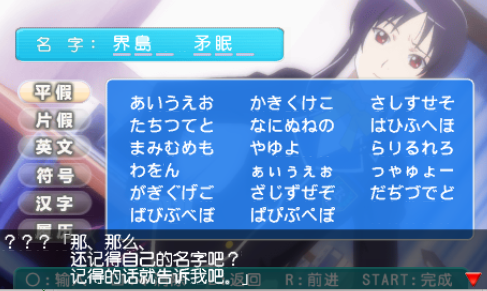
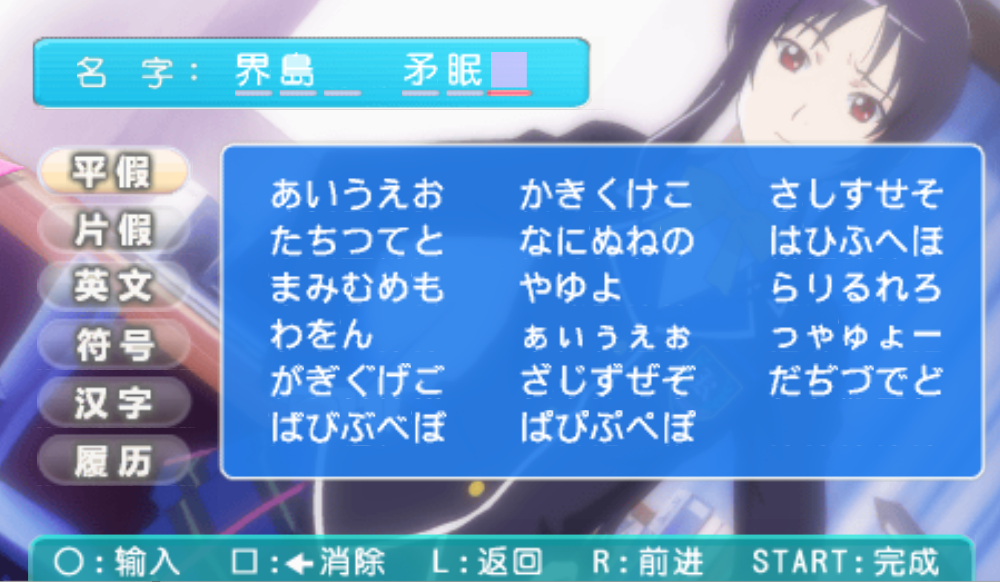

希望实现的功能1.为什么叫start文件夹,因为这里希望在设计主角名字哪些登记 
   
 就是这里的开始页面路由不应该再路由游戏游玩，并且现在也该为存档结构定性

---

## 当前实现合同（2026-08-01，用户确认）

> 本窗口只负责 `start`
> 标题页、梨子开场和玩家登记。角色权威：夕崎梨子是 User 的青梅竹马与美柑的姐姐，但不是 User，也不替玩家填写资料或作决定。

### 已确认决策

| 项           | 决策                                                                                 |
| ------------ | ------------------------------------------------------------------------------------ |
| 注册界面形态 | 确定性 GAL 开场 + 心跳回忆 4 式分步登记，布局使用 480×272 素材坐标系                 |
| 入口行为     | `restart` 与首次进入 → 玩家注册页；`continue` 读档跳过注册（无档时 continue 已禁用） |
| 字段范围     | 姓、名、生日月日、血型（A/B/AB/O/不明）；未确认“类型/兴趣/部活”不进入本轮            |
| 存档结构     | schema v3：`PlayerProfile` 定入 `PlayerState` 与 `GameSnapshot`                      |
| 改名规则     | **注册后名字固定**，不可改（名字是楼层配对签名的一部分，`message/protocol.ts:141`）  |
| cardStore    | 不在本窗口范围                                                                       |

### 数据链路（玩家信息）

```
PlayerRegistration（组件本地草稿，未确认不写权威状态）
  └─► completeNewSessionRegistration()
        ├─► playerStore.completeRegistration() → PlayerState.profile + 固定 name
        └─► gameStore.completeRegistration()   → registration → game

playerStore（内存，PlayerState + PlayerProfile）
  ├─► createGameSnapshot()  save/snapshot.ts:146-157   → GameSnapshot.player
  │     └─► savesolt write() → /api/files/upload       → Tavern user files 存档槽
  ├─► createSavePreview()    save/snapshot.ts:166-175   → 槽位预览 playerName
  └─► restoreGameSnapshot()  save/snapshot.ts:177-212   → 校验后写回 playerStore

名字消费方（注册后自动生效，无需改）：
  GalMainStory.tsx:69（AI 请求 playerName）、storyPresentation.ts:52（说话人归一化）、
  tavernStoryGeneration.ts:95（prompt）、index.tsx:143（render_game_to_text）、
  message/protocol.ts:99,141（楼层元数据+配对签名）、summaryPrompts.ts:204、storyPersistence.ts:96
```

### 本轮禁止扩线

1. 不清理 `cardStore` 或其消费方。
2. 不修改世界书、真实 Tavern `WORLDINFO_ENTRIES_LOADED` 链、剧情生成或说话人角色卡解析。
3. 不添加未定义业务含义的“类型/兴趣/部活”字段。
4. 不把 UI、本地状态或静态素材检查描述为真实 Tavern 接通。

### 后续验收点（本轮编码完成后交测试岗与人工）

| #   | 验收点                                                                              | 方式                |
| --- | ----------------------------------------------------------------------------------- | ------------------- |
| 1   | 存档 v3 契约：新字段/类型/范围校验断言                                              | 自动（verify 脚本） |
| 2   | 路由流转：`restart → 注册 → 完成 → game`；注册未完成不得进游戏；`continue` 跳过注册 | 自动（mock store）  |
| 3   | 名字固定：注册后无改名路径；历史消息签名与新档名字一致                              | 自动                |
| 4   | 名字消费方回归：prompt / render_game_to_text / GAL 归一化用新名字                   | 自动 + 人工         |
| 5   | 资料页回读：姓名、生日、血型与登记确认值一致；身高和体重仍显示“未登记”              | 自动 + 人工         |
| 6   | 视觉与交互：房间、梨子、对话、四步面板在目标 game-frame 和键鼠/触屏下可用           | 人工                |

世界书替换与 `cardStore` 清理不属于这些验收点；它们需要独立授权和独立战斗记录。
