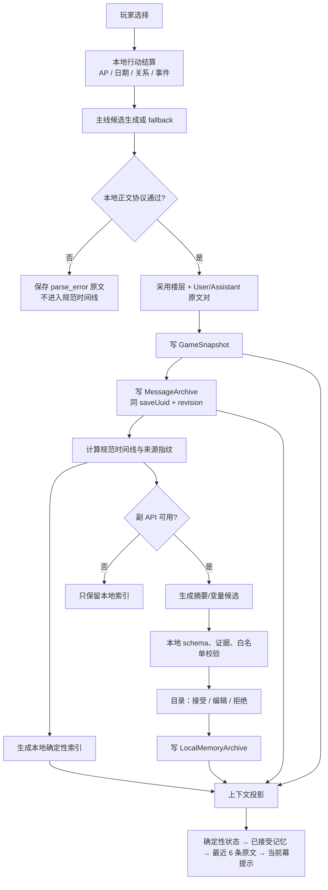

# 本地记忆与上下文系统实施规格

> 状态：历史实施草案。当前运行真相以 `MODULES.md` 为准，当前审查范围以 `ALDENT_STATUS.md` 为准。
>
> 实际首轮已先接入跨集最近 6 条消息、固定 2 楼层/5 小总结层级、600/1200 字正文上限、副 API 纯文本摘要、本地候选封装、浏览器候选审查与人工重试；候选暂存在浏览器 `memory-summary-archive:v3`，新候选的 `facts` 固定为空。当前加载器只接受 v3，遗留 v1/v2 即使仍留在浏览器存储中也不会加载或迁移。本文规划的 Tavern `LocalMemoryArchive` 侧档、本地确定性 fallback 索引、正式上下文注入、变量 shadow mode 与 shujuku 均尚未实现。下列五轮划分不再表示当前施工顺序。
>
> 日期：2026-07-23
>
> 依据：`MODULES.md`、`AI记忆与自主规划调研报告.md`、`save/`、`message/`、
> `services/storyGenerationContext.ts`、`services/localContextPreview.ts`、`config/openaiCompatible/`。

## 1. 开工结论

第一阶段采用“本地权威优先、AI 只提议、shujuku 后接”的路线：

1. `GameSnapshot v2` / Zustand 继续负责日期、AP、玩家属性、关系数值、技能和主线游标。
2. `MessageArchive v2` 继续保存不可改写的 User/Assistant 原文证据。
3. 新增独立的 `LocalMemoryArchive v1`
   侧档，保存本地索引、AI 候选、已接受记忆和人工决定；必要的重生成回执仍随剧情楼层保存，不能只放在可降级侧档里。
4. 最近原文窗口固定保留最多 6 条消息，而且只能按完整 User/Assistant 对裁剪。
5. 副 API 只生成摘要和变量语义候选。候选先进入“目录”的待确认区，未经接受不得进入剧情上下文，更不得写 AP、日期、事件或关系值。
6. 没有副 API、shujuku 或记忆侧档时，使用本地确定性索引作为保底；主存档、原文档案和 fallback 剧情仍可正常保存、读取和继续。

当前不应先接 shujuku。开发和测试一体的首要目标是让同一个存档在“无 API、API 失败、AI 候选被拒绝”三种情况下都能得到相同的机械状态和可解释的上下文。shujuku 将来只是可选的记忆来源适配器，不是新的游戏权威。

## 2. 三层权威

| 层                       | 权威内容                                             | 可否重建 | 丢失后的处理                                                 |
| ------------------------ | ---------------------------------------------------- | -------- | ------------------------------------------------------------ |
| `GameSnapshot` / Zustand | AP、日期、时段、属性、关系轴、技能、事件完成、当前幕 | 否       | 读档失败，必须显式报错                                       |
| `MessageArchive`         | 当前存档内全部剧情原文、楼层来源、采用/失败证据      | 否       | 严格读档失败，不用摘要冒充原文                               |
| `LocalMemoryArchive`     | 本地索引、AI 摘要候选、已接受记忆、人工审查记录      | 部分     | 隔离损坏侧档；本地索引可重建，玩家编辑与审查决定需从侧档恢复 |

`config/openaiCompatible/`
是浏览器级传输配置，不属于以上三层。API 密钥不进入任何存档、消息、记忆、提示词、调试 JSON 或日志。

关系数值仍只有一份权威：当前 `GameCharacter.affection/friendship/romance`。计划中的
`hurt`、危机状态、路线阶段和约会结算在未来 `datinglogic/` 中定义；记忆模块只读这些状态，不建立第二套关系 Store。

## 3. 数据链路



### 3.1 保存顺序

保存仍以现有两份必需文件为主：

```text
GameSnapshot 写入成功
→ MessageArchive 写入成功并校验 saveUuid + saveRevision
→ LocalMemoryArchive 尝试写入
```

三份文件不是数据库事务，不能宣传为原子写入。规则如下：

- `GameSnapshot` 或 `MessageArchive` 失败：本次保存失败，保持现有严格读档语义。
- `LocalMemoryArchive` 失败：主存档仍有效，界面显示“记忆侧档待重建”，后续重试；不得阻断游戏读档。
- 记忆 Store 的变化不订阅 `startTavernAutosave()`，避免“写摘要 → 触发主存档 revision → 摘要立刻过期”的循环。
- 手动另存槽位时，按新的 `saveUuid + revision` 重锚定来源仍匹配的已接受记忆；不复制旧槽位的 pending 请求。
- 删除存档时尝试删除记忆侧档。即使删除失败，旧 `saveUuid` 也不得被新存档加载。

## 4. 规范时间线与最近 6 条

现有 `getPreviousActiveStoryFloors()` 和 `selectGenerationMessages()` 只处理同一
`eventId`，因此第二集不能看到第一集的规范前文。摘要功能开工前先建立跨集时间线，不能只移除一处过滤条件。

### 4.1 规范时间线

`getCanonicalStoryTimeline()` 按剧集注册顺序和幕顺序选择：

- 只收录每幕 `activeFloorId` 指向的 `accepted` 楼层。
- 每个楼层必须有完整 User/Assistant 两条消息。
- `parse_error`、`request_error`、未采用重生成候选和已删除楼层不进入时间线。
- 当前待生成幕不进入自己的历史。
- fallback 楼层只要被采用就是合法规范前文，但始终保留 `source: 'fallback'` 标签。

### 4.2 原文窗口

`selectRecentStoryMessages()` 从规范时间线尾部按楼层对选择，最大 6 条消息，即最多 3 个完整楼层：

```text
8 条规范消息 = 4 对
长期记忆候选：第 1 对（消息 0、1）
最近原文窗口：后 3 对（消息 2～7）
```

不得使用普通 `slice(-6)` 从中间切断一对。若原文档案出现不完整配对，应由 `MessageArchive`
校验失败，而不是让上下文选择器猜测补齐。

### 4.3 摘要覆盖

不用单独的可回退索引决定哪些消息“已经总结”。每份摘要保存精确的
`sourceMessageIds + sourceFingerprint`；待总结窗口由规范时间线减去以下两部分得到：

1. 最近 6 条原文。
2. 已有且来源指纹仍匹配的已接受摘要覆盖范围。

如保留 `summarizedThroughOrdinal` 作为诊断字段，它只能前进。切换采用楼层时，旧摘要标记为
`stale`，新楼层形成新的未覆盖来源，不能把旧消息无条件重新塞回 prompt。

## 5. 文件和协议

新增文件侧档。A～C 阶段不升级 `GameSnapshot v2` 或 `MessageArchive v2`：

```text
/user/files/tokimeki-to-love-memory-{slotId}.json
```

协议常量：

```ts
export const MEMORY_PROTOCOL_VERSION = 1 as const;
export const MEMORY_SCHEMA_VERSION = 1 as const;
export const MEMORY_FILE_FORMAT = 'tokimeki-to-love-memory' as const;
export const MEMORY_FILE_FORMAT_VERSION = 1 as const;
export const MEMORY_REQUEST_EVENT = 'tolove:memory:request:v1';
export const MEMORY_RESPONSE_EVENT = 'tolove:memory:response:v1';

export type MemoryAction = 'probe' | 'write' | 'load' | 'delete';
```

加载规则：

| 情况                                     | 处理                                       |
| ---------------------------------------- | ------------------------------------------ |
| 文件不存在                               | 创建空 archive，并从规范时间线生成本地索引 |
| `saveUuid` 不同                          | 隔离为别的存档，不合并                     |
| 侧档 revision 落后，但来源 ID/指纹仍匹配 | 重锚定到当前 revision，保留已接受记忆      |
| 来源消息已切换、编辑或删除               | 相关记录标记 `stale`，不注入               |
| schema/JSON 损坏                         | 主读档继续；显示错误并允许从原文重建       |
| 侧档 revision 超前                       | 视为错误存档侧档，隔离并显式提示           |

D 阶段正式注入记忆时，精确的生成回执不能只存在于“可降级”的记忆侧档。新生成楼层应在现有 `GalStoryFloor`
和消息 metadata 中保存版本化的
`contextReceipt`；已存在且没有回执的 v2 楼层只能标为“按当前规范时间线重建”，不能声称精确复现。这个新增字段使用独立
`contextReceiptVersion: 1`，不静默改变 `contextFloorIds` 的旧含义；如实现时必须改变必填形状，再单独批准 snapshot/message
schema 升级。

## 6. 核心类型合同

以下字段名作为实现时的公共合同。展示字段可以扩充，但不得删掉来源锚点和审查状态。

```ts
export interface MemorySaveAnchor {
  slotId: string;
  saveUuid: string;
  saveRevision: number;
  snapshotFingerprint: string;
  messageArchiveFingerprint: string;
}

export interface MemorySourceRef {
  eventIds: string[];
  actIds: string[];
  floorIds: string[];
  messageIds: string[];
  sourceFingerprint: string;
}

export type MemoryOrigin = 'local-digest' | 'secondary-api' | 'player-edited';
export type MemoryReviewStatus = 'pending' | 'accepted' | 'rejected' | 'stale' | 'superseded';

export interface NarrativeMemorySummary {
  summaryId: string;
  source: MemorySourceRef;
  origin: MemoryOrigin;
  status: MemoryReviewStatus;
  title: string;
  text: string;
  createdAt: string;
  reviewedAt: string | null;
  providerRequestId?: string;
  model?: string;
}

export type NarrativeFactCategory =
  | 'event'
  | 'identity'
  | 'preference'
  | 'promise'
  | 'character-knowledge'
  | 'relationship-context';

export interface NarrativeMemoryFact {
  factId: string;
  source: MemorySourceRef;
  origin: MemoryOrigin;
  status: MemoryReviewStatus;
  category: NarrativeFactCategory;
  subjectId: string;
  claim: string;
  evidence: Array<{ messageId: string; quote: string }>;
  confidence: number;
}

export type RelationshipVariableKey = 'affection' | 'friendship' | 'romance';
export type VariableSignalDirection = 'increase' | 'decrease' | 'unchanged';
export type VariableSignalStrength = 'weak' | 'medium' | 'strong';

export interface VariableSignalProposal {
  proposalId: string;
  source: MemorySourceRef;
  status: MemoryReviewStatus;
  variableSchemaVersion: 1;
  targetCharacterId: string;
  variable: RelationshipVariableKey;
  direction: VariableSignalDirection;
  strength: VariableSignalStrength;
  confidence: number;
  evidence: Array<{ messageId: string; quote: string }>;
  rationale: string;
}

export interface MemoryReviewItem {
  reviewId: string;
  kind: 'summary' | 'fact' | 'variable-signal';
  recordId: string;
  status: MemoryReviewStatus;
  decisionNote: string | null;
  createdAt: string;
  decidedAt: string | null;
}

export interface ContextProjectionReceipt {
  contextReceiptVersion: 1;
  requestId: string;
  eventId: string;
  actId: string;
  anchor: MemorySaveAnchor;
  userMessageId: string;
  sourceMessageIds: string[];
  summaryIds: string[];
  factIds: string[];
  contextFingerprint: string;
  createdAt: string;
}

export interface LocalMemoryArchive {
  schemaVersion: typeof MEMORY_SCHEMA_VERSION;
  slotId: string;
  saveUuid: string;
  baseSaveRevision: number;
  updatedAt: string;
  summaries: NarrativeMemorySummary[];
  facts: NarrativeMemoryFact[];
  variableProposals: VariableSignalProposal[];
  reviewItems: MemoryReviewItem[];
}

// 新生成楼层和对应消息 metadata 保存同一份必要回执；
// LocalMemoryArchive 只保存其引用到的摘要/事实，不是重生成回执的唯一存储处。
export interface MemoryAwareStoryFloor extends GalStoryFloor {
  contextReceipt?: ContextProjectionReceipt;
}

export interface MemoryAnalysisCandidate {
  source: MemorySourceRef;
  summary: NarrativeMemorySummary;
  facts: NarrativeMemoryFact[];
  providerRequestId?: string;
  model?: string;
}
```

`VariableSignalProposal` 故意没有 `delta`、`newValue`
或写 Store 的方法。模型只表达“哪个方向、强弱、证据”，未来确定性结算器再根据行动、特技、冷却和当前关系阶段计算数值。`hurt`
等新轴要先进入正式关系 schema 和结算规则，再加入白名单；不能由副 API 自行创造。

## 7. 上下文投影合同

```ts
export interface MemoryContextProjection {
  anchor: MemorySaveAnchor;
  deterministicState: {
    date: CalendarDateValue;
    period: string;
    locationId: string;
    player: Pick<PlayerState, 'name' | 'intelligence' | 'athletics' | 'art' | 'charm'>;
    relationships: Array<{
      characterId: string;
      affection: number;
      friendship: number;
      romance: number;
    }>;
    completedEventIds: string[];
  };
  acceptedSummaries: NarrativeMemorySummary[];
  acceptedFacts: NarrativeMemoryFact[];
  recentMessages: Array<{ id: string; role: 'user' | 'assistant'; content: string }>;
  sourceMessageIds: string[];
  contextFingerprint: string;
}

export interface ComposedStoryContextProjection {
  memory: MemoryContextProjection;
  story: StoryGenerationContextProjection;
  finalUserInput: string;
  chatHistory: Array<{ role: 'user' | 'assistant'; content: string }>;
}
```

最终注入顺序固定为：

```text
1. 本地确定性游戏状态
2. 已确认的角色认知事实
3. 当前关系数值的短叠层
4. 玩家已接受的长期摘要/事实
5. 最近最多 6 条完整原文
6. 当前幕剧情提示和世界书路由
```

约束：

- `pending/rejected/stale/superseded` 永不进入 `finalUserInput`。
- 同一来源优先级为“玩家编辑并接受 > 玩家接受的 API 摘要 > 本地确定性索引”，只能注入一份。
- 本地索引只引用幕标题、日期、地点、人物和原文短引，不做自由语义推断，因此可以在无 API 时使用。
- 最近 6 条不因存在摘要而减少，也不因摘要为空而重新引入更旧原文。
- `finalUserInput` 是生成和预览共用的精确字符串。新楼层重生成读取楼层/消息 metadata 中保存的 `ContextProjectionReceipt`
  和 `userMessageId`，不能只从当前记忆侧档重新拼接另一份状态。
- 记忆、规划、证据和调试文字只属于 prompt，不进入 GAL `<content>` 正文。

第一版不做向量检索。长期记忆按规范时间线、角色相关性白名单和固定字符预算选择；在本地合同稳定前，不引入 embedding、MemoryDB 多表或自动自主规划。

## 8. 副 API 合同

`config/openaiCompatible/client.ts` 继续只负责 OpenAI 兼容传输。记忆业务不得写进该目录；新增业务适配器调用现有：

```ts
requestOpenAICompatibleCompletion(config, request);
```

建议的内部函数：

```ts
requestMemorySummaryCandidate(request, signal): Promise<MemoryAnalysisCandidate>
requestVariableSignalCandidates(request, signal): Promise<VariableSignalProposal[]>
```

副 API 只返回一段可读的中文摘要正文，不返回 JSON、标题、来源指纹、消息 ID、状态或 facts。输入仍可使用 JSON 数据块隔离原文与确定性状态，但输出不再把模型当作存储协议生成器。

本地 `createMemorySummaryPayloadFromText()` 负责：

- 统一换行、裁掉首尾空白，拒绝空正文、控制字符和超长正文；小总结上限 600 字符，大总结上限 1200 字符。
- 校验小总结恰好来自 2 个完整楼层，大总结恰好来自 5 条已接受小总结。
- 生成本地固定标题，并把新候选 `facts` 设为空数组；普通 prose 不能被本地代码反推成带伪造引文的结构化事实。
- 由运行时写入 `saveUuid`、revision、来源指纹、event/act/floor/message/summary ID、模型、请求 ID、状态和时间戳，再由 archive 使用 `JSON.stringify` 保存。
- 请求返回时重新核对 `saveUuid + requestRevision + sourceFingerprint`。换档、重抽、删除、编辑或来源变化后，迟到结果直接丢弃并记录原因。

纯文本合同放弃了对模型 facts/quote 的逐字段机器校验；当前安全边界是“候选默认 pending、必须人工审查、尚不注入剧情”。未来若需要结构化事实或变量信号，应建立独立的受限提取协议，不能从摘要正文猜测。

持久化后的已接受记忆可以随同一 `saveUuid`
后续 revision 继续使用，但每次投影仍要重新验证来源指纹。这个规则同时避免“任何一次普通自动存档都让全部长期记忆失效”。

第一轮 API 功能只做摘要候选。变量解析在下一轮以 shadow mode 展示：可看证据和建议方向，但没有任何“应用到数值”按钮。

## 9. 公共函数名

| 模块                              | 公共函数                                                   | 职责 / 副作用                                                       |
| --------------------------------- | ---------------------------------------------------------- | ------------------------------------------------------------------- |
| `memory/storyTimeline.ts`         | `getCanonicalStoryTimeline(archives, target?)`             | 纯函数；得到跨集采用楼层顺序                                        |
| `memory/storyTimeline.ts`         | `selectRecentStoryMessages(timeline, messages, limit = 6)` | 纯函数；按完整消息对选择最近原文                                    |
| `memory/storyTimeline.ts`         | `selectSummarySourceWindow(timeline, messages, archive)`   | 纯函数；选择最近窗口之前且尚未被有效摘要覆盖的完整消息对            |
| `memory/fingerprint.ts`           | `computeMemorySourceFingerprint(source)`                   | 对稳定字段和原文生成 SHA-256 指纹                                   |
| `memory/fingerprint.ts`           | `isMemoryResultCurrent(anchor, source, current)`           | 判定异步结果是否仍可采用                                            |
| `memory/archive.ts`               | `createEmptyMemoryArchive(save)`                           | 创建当前存档的空侧档                                                |
| `memory/archive.ts`               | `validateMemoryArchive(value, expectedSave)`               | 严格校验 schema、身份、ID 唯一性和来源引用                          |
| `memory/archive.ts`               | `reconcileMemoryArchive(archive, snapshot, messages)`      | 保留匹配记录；将失效记录标记为 stale；不写游戏状态                  |
| `memory/archive.ts`               | `appendMemoryCandidate(archive, candidate)`                | 加入已验证候选，重复指纹幂等                                        |
| `memory/archive.ts`               | `reviewMemoryItem(archive, command)`                       | 接受、编辑、拒绝或撤销；保留审计记录                                |
| `memory/fallback.ts`              | `createLocalMemoryDigest(source, registry)`                | 从权威元数据和短原文引文生成无模型保底索引                          |
| `memory/analyzer.ts`              | `buildMemoryAnalysisRequest(source, state)`                | 生成副 API 的最小输入，不含密钥和无关完整快照                       |
| `memory/summaryPrompts.ts`        | `createSmallSummaryPrompt(input)`                          | 校验完整 User/Assistant 对和只读状态锚点，生成小总结 TIDD-EC 提示词 |
| `memory/summaryPrompts.ts`        | `createLargeSummaryPrompt(input)`                          | 校验 5 条已接受小总结和只读状态锚点，生成大总结 TIDD-EC 提示词      |
| `memory/summaryAnalyzer.ts`       | `createMemorySummaryPayloadFromText(text, context)`        | 规范纯文本并生成本地标题/正文/空 facts；不写 archive                 |
| `memory/analyzer.ts`              | `requestMemorySummaryCandidate(input, signal)`             | 调用既有 OpenAI 兼容客户端并返回候选                                |
| `memory/contextProjection.ts`     | `createMemoryContextProjection(input)`                     | 生成可预览、可指纹化的记忆上下文                                    |
| `memory/contextProjection.ts`     | `composeStoryGenerationContext(story, memory)`             | 产出生成器实际使用的 `finalUserInput` 和最近原文                    |
| `memory/runtime.ts`               | `queueMemoryProposal(source)`                              | 去重并启动异步摘要；只更新记忆运行态                                |
| `memory/runtime.ts`               | `retryMemoryJob(jobId)`                                    | 只从总结/待确认视图重试失败任务；先重验存档锚点与来源指纹           |
| `memory/runtime.ts`               | `cancelMemoryJobs(reason)`                                 | 换档、回标题或来源变化时取消请求                                    |
| `memory/runtime.ts`               | `rebuildMemoryForCurrentSave()`                            | 从当前快照和原文重建本地索引，保留匹配的人工记录                    |
| `memorysolt/client.ts`            | `loadMemoryArchiveFor(save)`                               | 读取并校验同存档侧档                                                |
| `memorysolt/client.ts`            | `saveMemoryArchiveFor(save, archive)`                      | 写侧档并回读校验 UUID/revision                                      |
| `memorysolt/client.ts`            | `deleteMemoryArchiveFor(slotId, saveUuid?)`                | 删除指定侧档                                                        |
| `services/localContextPreview.ts` | `createLocalContextPreview()`                              | 汇总快照、原文、记忆和最终投影；不触发生成或摘要                    |

## 10. 模块实现定义

| 模块                                   | 负责                                              | 不负责                              |
| -------------------------------------- | ------------------------------------------------- | ----------------------------------- |
| `memory/types.ts`                      | 上述领域类型和状态枚举                            | 校验、网络、UI                      |
| `memory/schema.ts`                     | LocalMemoryArchive 严格校验、规范化、唯一性检查   | 自动迁移、业务选择                  |
| `memory/storyTimeline.ts`              | 跨集规范楼层、消息配对、最近窗口和摘要窗口        | 修改 active floor                   |
| `memory/fingerprint.ts`                | 稳定序列化和来源/上下文指纹                       | 决定是否接受 AI 内容                |
| `memory/archive.ts`                    | 记录合并、审查命令、stale/superseded 转换         | 游戏数值写回                        |
| `memory/fallback.ts`                   | 无 API 的确定性索引                               | 自由生成剧情或推断玩家意图          |
| `memory/summaryAnalyzer.ts`            | 纯文本规范化与本地 payload 构造                   | OpenAI 地址/密钥保存、关系结算      |
| `memory/summaryPrompts.ts`             | 2/5 来源校验、权威边界与纯文本输出提示            | 网络、响应解析、候选采用            |
| `memory/summaryProgress.ts`            | 非持久化阶段、真实百分比或不定进度、完成/错误状态 | 摘要时机、请求、存档                |
| `memory/contextProjection.ts`          | 有预算、有来源的最终上下文投影                    | 调用 Tavern、修改世界书             |
| `memory/memoryStore.ts`                | 当前侧档缓存、请求状态、可见错误和取消句柄        | AP、日期、关系权威                  |
| `memory/runtime.ts`                    | 在存读档、采用楼层和换档事件间编排记忆工作        | React 渲染、宿主 hidden floor       |
| `memorysolt/protocol.ts`               | 侧档事件协议和文件 envelope                       | 记忆业务规则                        |
| `memorysolt/client.ts`                 | 前端事件传输和超时                                | SillyTavern 文件实现                |
| `memorysolt/index.ts`                  | `/user/files` 读写、回读校验和 bridge 生命周期    | shujuku、数据库、聊天楼层           |
| `config/openaiCompatible/`             | 配置、模型列表、completion 传输                   | 摘要时机、候选 schema、存档         |
| `services/storyGenerationContext.ts`   | 组合当前幕提示、规范原文和已接受记忆              | 摘要生成或人工审查                  |
| `services/localContextPreview.ts`      | 只读聚合成 UI view model                          | 在读取时偷偷启动 API                |
| `components/ContextPreviewModal.tsx`   | 弹窗壳、tab、刷新、关闭和总状态                   | 直接访问底层文件或改 Store          |
| `components/MemorySummaryProgress.tsx` | 地图框内短时进度/失败回显和 `push_0~3` 等待动画   | 启动/重试摘要、锁地图或长期占据画面 |
| `components/context-preview/*`         | 上下文、快照、原文、长期记忆、待确认子视图        | 拼 prompt、解析 AI 输出             |

`index.tsx` 只装配初始化和销毁，不加入摘要业务。`mainStoryStore`
只发出“采用楼层已变化”的事实，不接副 API。`config/openaiCompatible` 不因记忆业务继续膨胀。

## 11. “目录”弹窗信息架构

继续复用当前地图菜单 `index / 目录` 入口，`data / 数据` 保持占位；不建立第二个记忆入口。

| Tab        | 首轮内容                                                                            | 写操作                           |
| ---------- | ----------------------------------------------------------------------------------- | -------------------------------- |
| 本轮上下文 | 最终注入顺序、来源 ID、字符预算、最近 6 条和接通标签                                | 无                               |
| 本地快照   | 日期/AP/属性/关系/技能/事件                                                         | 无                               |
| 原文档案   | 规范、未采用、fallback、parse_error 分组；原文可展开                                | 无                               |
| 长期记忆   | 本地索引和已接受摘要/事实，显示覆盖范围与证据                                       | 第二轮允许“撤销采用”             |
| 待确认     | AI 候选与原文证据并排；失败任务显示原因与重试，重试前校验 save/revision/fingerprint | 第二轮允许接受、编辑、拒绝、重试 |
| 变量信号   | 当前关系值和副 API 方向建议并排                                                     | 后续 shadow mode；无应用按钮     |

每条 AI 记忆必须直接显示：来源幕、消息 ID、真实引文、模型、时间、状态和“会不会进入下次上下文”。玩家编辑后保存为
`player-edited` 新记录，原候选标记 `superseded`，不覆盖审计证据。

地图进度条只报告当前阶段；成功后 3.5 秒、失败后 5 秒自动收起，不承载重试按钮。失败原因保留在非持久化记忆运行态，由“待确认”视图读取；真实重试必须调用
`retryMemoryJob(jobId)`，来源已经变化时拒绝沿用旧请求并要求重新建候选。

弹窗只是当前项目横屏 game-frame 内的条件化方案，不升级为通用 UI 模式。实现时继续检查桌面、手机横屏、关闭/返回、焦点、滚动和现有全屏按钮遮挡；不能用一张截图证明完整数据链。

## 12. 首轮开火范围

建议把真正实现拆为五轮，首轮只做 A：

### A. 本地时间线与只读记忆骨架（建议下一轮）

- 新增跨集规范时间线和完整消息对裁剪。
- “目录”显示总规范消息数、最近 6 条、待总结条数和被排除候选原因。
- 新增 `LocalMemoryArchive` schema、纯函数校验、内存空档和本地确定性索引。
- 新增“长期记忆/待确认”只读空状态；不发副 API，不写新 Tavern 文件。
- 不改关系 schema，不接 shujuku。

### B. 本地记忆侧档

- 增加 `memorysolt/` 文件桥和存读档编排。
- 缺失/损坏/落后侧档可见降级并可重建。
- fallback 截图和真实文件回读分别取证，不互相冒充。

### C. 副 API 摘要候选与人工审查

- 使用现有 OpenAI 兼容配置。
- 实现取消、去重、超时、迟到结果丢弃、纯文本规范化和本地来源重验。
- 只有人工接受或编辑后的摘要进入 `accepted`。

### D. 正式上下文注入与重生成冻结

- `composeStoryGenerationContext()` 成为 Tavern 调用与预览的唯一投影。
- 在新楼层及对应消息 metadata 保存版本化 `ContextProjectionReceipt`；记忆侧档不是其唯一副本。
- 重生成复用当时的 User prompt、历史消息 ID 和记忆记录 ID；旧 v2 楼层若只能重建要在 UI 显式标记。
- 验证摘要为空、拒绝、侧档缺失时仍固定保留最近 6 条。

### E. 变量解析 shadow mode，再决定 shujuku

- 只展示 `affection/friendship/romance` 的方向、强弱和证据。
- 等 `datinglogic` 的 `hurt`、危机和结算规则批准后，再给本地结算器消费信号。
- 本地链通过后才评估 shujuku 适配器；它不能替代侧档、审查或本地 fallback。

## 13. 必测合同

### 纯函数

- 第一集两幕 + 第二集前两幕共 8 条规范消息时，最近窗口是消息 2～7，消息 0～1 是待总结完整对。
- 两集全部五幕共 10 条规范消息时，最近窗口是消息 4～9，消息 0～3 恰好组成首个 2 楼层小总结批次。
- 未采用重生成候选、`parse_error` 和当前幕旧候选不进入最近窗口或摘要来源。
- fallback 采用楼层进入规范时间线且来源标签不丢失。
- 选择新的 active floor 后，旧来源摘要变 `stale`，不会继续注入。
- 摘要为空和消息不存在是不同状态；空摘要不能让旧原文回流。
- 同一来源重复触发只产生一个 pending 任务。

### 异步与存档

- API 请求中换档、回标题、重抽、删楼层或来源编辑：结果被取消或丢弃。
- 记忆文件缺失、损坏、旧 revision：主存档与原文仍能读取；错误可见。
- 主存档与 MessageArchive revision 不一致：仍按现有严格规则失败，记忆侧档不能掩盖。
- 手动另存后 accepted 记忆按新 UUID 重锚定，pending 请求不复制。
- 记忆写入不会触发新的主存档 autosave 循环。

### 权威与 UI

- 接受、编辑、拒绝摘要都不改变 AP、日期、事件或关系数值。
- API 禁用与 API 失败时，机械状态、fallback 正文和最近 6 条选择完全一致。
- Context Preview 显示的 `finalUserInput/messageIds/contextFingerprint` 与实际 Tavern 请求一致。
- 变量 signal 即使接受也只保持 shadow 状态，没有写 Store 路径。
- 桌面与手机横屏中弹窗无按钮遮挡、文本越界、不可关闭或焦点逃逸。

首轮验证使用现有 `pnpm watch` 产物，不另跑 `pnpm build`；浏览器重点截图 fallback、8 条消息的“6 条原文 +
2 条待总结”以及无 API 的本地索引。真实副 API、真实文件桥和 shujuku 分别保留独立接通标签。

## 14. 明确不做

- 不复制 islandmilfcode 的多表 MemoryDB。
- 不引入向量库、embedding、自动自主规划或 NPC 自主推进日期/AP。
- 不让摘要替代最近 6 条原文。
- 不让 AI 直接输出或应用关系最终数值。
- 不把人物完整世界书复制进关系或记忆叠层。
- 不创建 hidden host floor，不触发 `MESSAGE_SENT`、`/trigger`、ACU、shujuku 或数据库。
- 不把本地弹窗、文件镜像或副 API 成功描述成真实宿主集成。

## 15. 批准口径

下一轮若批准“A. 本地时间线与只读记忆骨架”，实现范围只包含该节五项和对应测试。B～E 仍需在上一轮人工查看数据、fallback 和错误状态后分别批准，不能因为本规格存在就自动连续实现。
