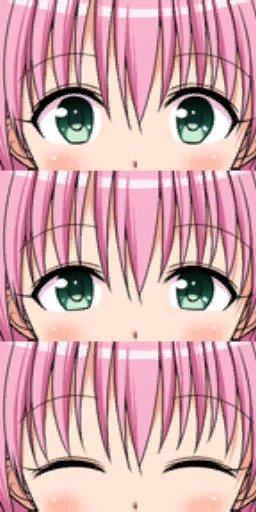
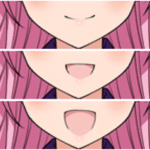
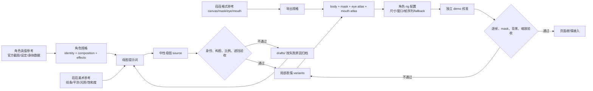

# 菈菈分层动态立绘制作与接入指南

这份文档记录当前菈菈与西连寺春菜动态立绘的真实素材结构、网页还原方法，以及以后自己制作新表情或新角色时应遵守的制图规范。

文档中的内容分成两类：

- **实测事实**：已经从当前 PNG、浏览器像素和代码中确认，可以直接用于本项目。
- **制图建议**：为了以后制作新素材更稳定而制定的规范，不代表原游戏一定这样制作。

## 先说结论：这不是 Live2D

当前效果更准确的名称是：

```text
Alpha Mask 分层立绘 + 眼睛/嘴巴三帧图集动画
```

它不属于 Live2D Cubism，原因是素材中没有
`.moc3`、`.model3.json`、参数、网格变形和物理配置。原素材库呈现 Unity 资源导出结构，并且存在
`CharacterEyeAnim`、`CharacterMouthAnim` 等 MonoBehaviour 组件，说明原游戏由独立脚本切换眼睛和嘴巴贴图。

当前网页版实现的是相同的可见思路，不是对原 Unity 运行代码的逐行移植：

```text
身体底图
+ 眼睛局部图集
+ 嘴巴局部图集
-> 统一套用 Alpha mask
-> 整体执行入场、呼吸和响应式缩放
```

只有发现 Cubism 模型文件、网格、骨骼或参数绑定数据时，才应该改称 Live2D 或绑定式 2D。

## 当前素材一览

### 菈菈立绘

目录：[`artsource/lala/`](artsource/lala/)

| 用途       | 文件                         |  原始尺寸 | 数量 |
| ---------- | ---------------------------- | --------: | ---: |
| 身体底图   | `004_03_03_a #2247.png`      | 1024x1024 |    1 |
| Alpha mask | `004_03_03_a.png`            |   512x512 |    1 |
| 眼睛图集   | `004_03_03_{a..f}_eye.png`   |   256x512 |    6 |
| 嘴巴图集   | `004_03_03_{a..f}_mouth.png` |   256x256 |    6 |

<p>
  
  
  
</p>

注意：身体底图的 1024x1024 像素全部不透明，看到的黑色区域不是透明背景。真正负责裁出人物轮廓的是 512x512
mask 的 Alpha 通道，不能用“删除黑色”代替 mask，因为人物翅膀本身也含黑色。

mask 的实测 Alpha 有效包围盒为：

```text
x = 28..496
y = 15..511
```

mask 虽然只有身体底图一半的分辨率，但运行时会被拉伸到完整 1024x1024 舞台。分辨率不同不等于坐标系不同。

### 西连寺春菜立绘

目录：[`artsource/haruna/`](artsource/haruna/)

| 用途       | 文件                         |  原始尺寸 | 数量 |
| ---------- | ---------------------------- | --------: | ---: |
| 身体底图   | `005_01_01_a #27501.png`     | 1024x1024 |    1 |
| Alpha mask | `005_01_01_a.png`            |   512x512 |    1 |
| 眼睛图集   | `005_01_01_{a..f}_eye.png`   |   256x512 |    6 |
| 嘴巴图集   | `005_01_01_{a..f}_mouth.png` |   256x256 |    6 |

春菜使用与菈菈相同的旧式三帧容器格式。身体底图同样是 1024x1024 全不透明 PNG，轮廓由 512x512
mask 的 Alpha 通道裁出；mask 的实测 Alpha 有效包围盒为半开区间 `(128,67)-(366,512)`。文件名中的空格和 `#`
在运行路径中分别编码为 `%20` 和 `%23`。

### 对话框素材

目录：[`artsource/galbox/`](artsource/galbox/)

| 用途           | 文件                    |     尺寸 |
| -------------- | ----------------------- | -------: |
| 正文窗口       | `msg_window.png`        | 1024x128 |
| 菈菈姓名牌皮肤 | `lala/wasya04_lala.png` |   256x64 |
| 点击提示       | `push_0.png`            |    76x50 |
| 点击提示       | `push_1.png`            |    76x50 |
| 点击提示       | `push_2.png`            |    76x50 |
| 点击提示       | `push_3.png`            |    73x50 |

`wasya04_lala.png` 只是一张姓名牌皮肤，本身没有“菈菈”文字。当前名字由 HTML 文字叠在白色区域中。

`push_0` 与 `push_2` 内容相同，但它们是动画的回中帧，不能去重。四帧以 8fps 播放，每帧 125ms。

## 1024x1024 逻辑舞台

所有层必须先在同一个 1024x1024 逻辑舞台中对齐。外部想只显示半身或缩小人物，应裁剪、移动或缩放整个舞台，不能分别调整眼睛和嘴巴。

当前两套立绘眼嘴窗口的实测坐标：

| 角色 | 窗口 |   x |   y |  宽 |  高 | 百分比                                                     |
| ---- | ---- | --: | --: | --: | --: | ---------------------------------------------------------- |
| 菈菈 | 眼睛 | 394 | 237 | 230 | 131 | `left:38.477%; top:23.145%; width:22.461%; height:12.793%` |
| 菈菈 | 嘴巴 | 394 | 365 | 230 |  57 | `left:38.477%; top:35.645%; width:22.461%; height:5.566%`  |
| 春菜 | 眼睛 | 394 | 221 | 230 | 131 | `left:38.477%; top:21.582%; width:22.461%; height:12.793%` |
| 春菜 | 嘴巴 | 394 | 349 | 230 |  57 | `left:38.477%; top:34.082%; width:22.461%; height:5.566%`  |

换算公式：

```text
left%   = x / 1024 * 100
top%    = y / 1024 * 100
width%  = width / 1024 * 100
height% = height / 1024 * 100
```

菈菈眼睛窗口结束于约 `y=368`，嘴巴窗口从 `y=365` 开始；春菜眼睛窗口结束于约 `y=352`，嘴巴窗口从 `y=349`
开始。两套素材都约重叠 3 个逻辑像素。当前 DOM 先绘制眼睛，再绘制嘴巴，因此重叠区域由嘴巴层覆盖。不要随意交换层级。

## 官方图集为什么不能保持原始比例

这是本次最关键的研究结论。

源 PNG 使用旧式幂次方纹理画布，但显示时会被非等比拉伸成三个窗口高度：

| 图集 |  源 PNG | 浏览器内完整图集 | 每个显示窗口 |
| ---- | ------: | ---------------: | -----------: |
| 眼睛 | 256x512 |          230x393 |      230x131 |
| 嘴巴 | 256x256 |          230x171 |       230x57 |

正确 CSS：

```css
.face-window {
  position: absolute;
  overflow: hidden;
}

.face-window > img {
  position: absolute;
  top: 0;
  left: 0;
  width: 100%;
  height: 300%;
  max-width: none;
  max-height: none;
}
```

三帧位置：

```text
第 0 帧：top: 0
第 1 帧：top: -100%
第 2 帧：top: -200%
```

这里 `top` 的百分比相对于裁切窗口高度，因此每次正好移动一个显示帧。

不要写：

```css
height: auto;
object-fit: contain;
transform: translateY(-100%);
```

`height:auto`
会把眼睛图集按宽度等比放大到约 230x460，把嘴巴放大到约 230x230，裁切窗口就会截到错误的额头、鼻子或下巴。`transform: translateY(-100%)`
的百分比相对于整张图集自身，会一次移动三帧。

如果必须使用 transform，第 `frame` 帧应按图集总高度计算：

```css
transform: translateY(calc(var(--frame) * -33.3333333333%));
```

### 不要因为不能整除就猜成四帧

`512 / 3` 和 `256 / 3`
不是整数，但这不代表图集是四帧。旧游戏可能先使用幂次方纹理，再把整张纹理重采样成三个显示窗口高度。

帧数必须由以下证据确认：

- 原游戏实际动画。
- 连续画面内容。
- 引擎组件或脚本名称。
- 浏览器逐帧还原是否与官方画面吻合。

不能只根据文件能否被整数整除来猜帧数。

## 菈菈 a-f 表情内容

字母目前只是素材编号，不是正式的情绪语义。制作剧情时应先看图，再决定它适合哪一句话。

| 编号 | 眼睛内容                   | 嘴巴内容                 | 当前眨眼 |
| ---- | -------------------------- | ------------------------ | -------- |
| `a`  | 睁眼、半闭、闭眼           | 微笑闭口、中开、大开     | 是       |
| `b`  | 担忧睁眼、半闭、闭眼       | 小抿嘴、小圆口、大圆口   | 是       |
| `c`  | 三帧均为用力闭眼的轻微变化 | 微笑、中开、大笑         | 否       |
| `d`  | 睁眼、半闭、闭眼           | 平口、中开、较大开口     | 是       |
| `e`  | 睁眼、半闭、闭眼           | 担忧汗滴、小圆口、大圆口 | 是       |
| `f`  | 三帧均为闭眼带汗的轻微变化 | 紧张闭口、中开、大开     | 否       |

`c`、`f` 的基础眼型已经闭合，所以代码明确关闭自动眨眼，避免出现不自然的二次闭眼。

### 春菜第一幕当前映射

春菜的字母同样只是素材编号，当前第一幕采用最小映射：

| 剧情状态              | 表情 |
| --------------------- | ---- |
| 校内页默认/非本人发言 | `a`  |
| 西连寺春菜本人发言    | `f`  |
| `flash`               | `d`  |
| `shake`               | `e`  |

春菜的 `b`、`e` 基础眼型已经闭合，因此关闭自动眨眼；`e` 已在第一幕受惊页实测为静态闭眼。`a/f/d/e`
是否最符合每句情绪仍属于人工美术判断，不把字母编号写成固定情绪真值。

## 当前动画节奏

| 动画     | 节奏       | 说明                                         |
| -------- | ---------- | -------------------------------------------- |
| 入场     | 260ms      | 从右侧 24px 淡入                             |
| 呼吸     | 4.2s 循环  | 中点上移 2px，`scaleY(1.0025)`               |
| 眨眼     | 4.2s 循环  | `0 -> 1 -> 2 -> 1 -> 0`，同一角色跨页连续    |
| 说话     | 420ms x 4  | 总计约 1.68s，只在当前立绘对应角色发言时播放 |
| 点击提示 | 500ms 循环 | 四帧，每帧 125ms，8fps                       |

眼图不使用正文页 `beatKey` 作为 React
key，因此同一角色翻页或切换可眨眼表情时不会重新等待完整 4.2s 周期。嘴图仍使用正文页 key，保证每段新发言重新开始短口型。

说话动画只是短口型循环，不是根据音频音素计算的 lip sync。

启用 `prefers-reduced-motion: reduce` 时，入场、呼吸、眨眼和口型停止，点击提示只保留第一帧。

实现位置：

- [`GalMainStory/LayeredPortrait.tsx`](GalMainStory/LayeredPortrait.tsx)
- [`GalMainStory/galAssets.ts`](GalMainStory/galAssets.ts)
- [`GalMainStory/GalMainStory.css`](GalMainStory/GalMainStory.css)
- [`GalMainStory/GalMainStory.tsx`](GalMainStory/GalMainStory.tsx)

## 自己制作新表情：兼容当前代码的路线

这是不用改组件的最短路线。

1. 复制一组现有 `a_eye` 和 `a_mouth` 作为模板。
2. 保持眼睛文件 256x512、嘴巴文件 256x256，不要自动裁边。
3. 在同一张 1024x1024 主画布中完成完整人物。
4. 按当前眼窗 `394,237,230,131` 和嘴窗 `394,365,230,57` 导出三个局部状态。
5. 将三个眼睛状态纵向重采样到完整 256x512 纹理。
6. 将三个嘴巴状态纵向重采样到完整 256x256 纹理。
7. 保存为同一个新编号，例如 `g_eye` 与 `g_mouth`。
8. 在 `LalaExpression` 中加入 `g`，再在剧情页选择它。

眼嘴贴片不是“只有眼球和嘴巴的透明小图”。官方贴片包含周围头发、皮肤、脸颊和下巴，用整块局部画面覆盖底图，才能保持边缘一致。

文件名规则：

```text
004_03_03_{expression}_eye.png
004_03_03_{expression}_mouth.png
```

必须同时提供眼睛和嘴巴文件。身体文件名包含空格和 `#`，URL 中必须写成 `%20%23`，裸 `#` 会被浏览器当成 fragment。

## 没有现成官方立绘的新人物：先拆开身份、画风和格式

菈菈素材可以承担两种职责，但不能把它当成新人物的身份参考：

| 参考类型     | 决定什么                                               | 不决定什么                                   |
| ------------ | ------------------------------------------------------ | -------------------------------------------- |
| 角色真值参考 | 发型、瞳色、脸型、服装、饰品、体型、特殊设定           | 不决定最终图集尺寸                           |
| 菈菈美术参考 | 线条、赛璐璐阴影、肤色、光线、饱和度、旧式游戏立绘观感 | 不提供菈菈的绿眼、帽子、翅膀、脸型或幼态比例 |
| 菈菈格式参考 | 1024 舞台、mask、眼嘴局部覆盖、三帧纵向图集            | 不决定新人物眼嘴窗口坐标                     |
| 运行时参考   | 图层顺序、帧序列、fallback、动画节奏                   | 不参与角色造型设计                           |

最容易失败的写法是“把这个人物画成菈菈风格”。生成模型往往会把“风格”错误解释成“长得像菈菈”。实际提示词必须把身份真值和美术参考分段，并逐项写出禁止迁移的人物特征。

### 可复用母图提示词

下面模板采用“参考样例 + 明确 Do/Don't”的结构。方括号内容应替换为当前人物资料；引用图片时也要写清每张图只负责什么。

```text
任务：生成一张供分层动态立绘制作使用的角色母图。角色身份必须来自“角色真值参考”，只从“菈菈格式/美术参考”提取旧版画面语言，不复制菈菈的人物特征。

参考图职责：
1. 角色真值参考：[列出官方截图或设定图]。只用来确定人物身份、脸型、发型、瞳色、服装、饰品、体型和特殊设定。
2. 美术参考：artsource/lala/004_03_03_a #2247.png。只提取清晰的深色轮廓线、平涂赛璐璐上色、少量硬边阴影、柔和浅肤色、中等偏高但不过曝的饱和度、旧式日系动画游戏立绘的光照和质感。
3. 格式参考：菈菈 body、mask、eye atlas、mouth atlas。只参考人物在 1024×1024 舞台中的占比和局部覆盖思路，不要求生成模型直接输出图集。

构图：
- 1024×1024 正方形逻辑舞台，人物正面朝向镜头，头部不裁切。
- [长三分之四身 / 指定构图]，人物在画面中的比例接近菈菈 body，不生成缩小的远景全身，也不退化成胸像。
- 双眼、鼻梁、嘴、下巴保持在正脸透视中，身体中心线稳定，便于后续制作眼嘴覆盖窗口。
- 背景只用无物体、无纹理的中性校准底；最终背景、透明轮廓和 mask 由后处理产生。

角色身份硬约束：
- 角色：[角色名]。
- 身高、体重、三围：[数值]。不要把数字画成文字；把胸腰比、腰臀比转化为可见但自然的轮廓关系。
- 必须保留：[发型、瞳色、脸型、服装、额饰、项圈、角色专属物件]。
- 特殊视觉设定：[遮挡、伤痕、异色瞳等的准确范围和作用]。

美术要求：
- 旧式日系电视动画/视觉小说立绘观感，不采用 2020 年以后常见的高亮渐变、电影级体积光、厚涂皮肤、3D 渲染或高频材质细节。
- 线稿干净、连续、粗细变化有限；发丝以成组色块和少量内线表达。
- 每种材质以固有色为主，通常只使用一个主阴影层和少量高光；皮肤阴影偏暖粉，不使用写实毛孔或复杂环境反射。
- 高光面积克制，脸部和服装保持可切图的平整色块；整体清晰度、对比度和饱和度接近美术参考。

必须做到：
- 先保证角色辨识度，再匹配画面语言。
- 保持正脸、稳定对称结构和可重复的眼嘴区域。
- 特效或遮挡必须同时覆盖基础脸和以后生成的所有表情帧。
- 输出单一稳定中性表情的母图，不在一张图中混入多个表情或多个角色。

禁止：
- 不得复制菈菈的绿眼、帽子、翅膀、尾巴、服装、脸型、幼态头身比或夸张开朗表情。
- 不得生成婚纱、头后垂布、肩后披纱或无设定依据的背景物件。
- 不得使用蓝色摄影棚背景、场景背景、景深光斑、文字、水印、边框。
- 不得声称一次生成的 PNG 已经是官方 Unity body/mask/atlas 格式。

输出：一张高分辨率角色母图。人物结构、身份和构图验收通过后，再单独生成或绘制半闭眼、闭眼、中开口和大开口状态；不要在第一步直接拼图集。
```

### Sephie 的已填充约束示例

Sephie 这一轮实际使用的关键约束应写成下面这样，而不是只写“菈菈画风的粉发女性”：

```text
角色是赛菲·米卡埃拉·戴比路克，167 cm、50.7 kg、92/58/90 cm。三围只作为轮廓约束：丰满胸围、明显收腰、臀围接近胸围，同时保持成年女性的纤细四肢和自然躯干长度。保留长浅粉发、粉紫眼睛、金色额饰与紫色垂坠宝石、金色紫宝石项圈、白/深蓝/红/金配色礼服。

人物正面、长三分之四身、占画比例接近菈菈原 body。面纱仅位于正脸前方，从刘海下覆盖眼、鼻、嘴到下巴附近；它的功能是降低面部细节约 40%～50% 的对比度和饱和度，让五官仍可辨认但明显被遮住。面纱不得延伸到头后、肩后或身体周围，不得形成婚纱轮廓。

只借用菈菈素材的旧式赛璐璐线条、平涂、光照、饱和度和立绘占比。不要生成菈菈的绿眼、帽子、翅膀、服装、幼态脸型或人物性格特征；不要使用蓝色背景，也不要添加任何室内、王宫或婚礼背景。
```

这里的 `92/58/90` 不能从单张二维图中得到精确测量值。正确用法是把它转换成胸腰比约 `1.586`、臀腰比约 `1.552`
的轮廓验收约束，再由人检查是否符合角色设定，而不是声称像素已经“证明”三围数值。

### 母图与表情帧必须分两轮生成

第一轮只解决身份、构图、比例、服装和特殊遮挡。第二轮必须以通过验收的母图作为唯一角色参考，只改变指定局部：

```text
以已通过验收的角色母图为唯一身份和构图基准。保持画布、镜头、头部位置、刘海、额饰、面纱边缘、鼻梁、下巴、项圈、身体和背景逐像素级稳定，只生成一个局部状态：[半闭眼 / 闭眼 / 中开口 / 大开口]。除指定眼睛或嘴部外，不改变任何人物特征、色彩、线条粗细、光照或遮挡强度。
```

如果模型让头发、面纱或下巴跟着表情变化，这一帧不能直接进入 atlas。应先局部修图或回到母图重做，不能靠运行时代码掩盖结构漂移。

## 两种新角色导出路线：官方兼容与干净格式

“画得像官方”与“文件是官方格式”是两件事。至少要分别说明三层兼容性：

| 层级     | 含义                                                     | Sephie 当前状态                                 |
| -------- | -------------------------------------------------------- | ----------------------------------------------- |
| 视觉兼容 | 角色、旧式线条、平涂、光照、饱和度和构图接近目标         | 仍需继续人工优化                                |
| 纹理兼容 | body/mask/eye/mouth 的尺寸、坐标、Alpha 语义与原素材一致 | 部分兼容；眼嘴容器尺寸相同，mask 仍为 1024×1024 |
| 引擎兼容 | Unity 元数据、组件、资源 ID 和原始运行行为一致           | 不兼容；当前是网页演示原型                      |

若目标是最大程度复用菈菈链路，采用“官方容器兼容路线”：

```text
body:        1024x1024
mask:         512x512（运行时拉伸到 1024x1024）
eye atlas:    256x512（三帧纵排，显示时非等比重采样）
mouth atlas:  256x256（三帧纵排，显示时非等比重采样）
```

若目标是新网页组件、无需还原旧 Unity 纹理限制，可以采用“干净整数帧路线”：

```text
master canvas: 1024x1024
eye frame:     230x131
eye atlas:     230x393
mouth frame:   230x57
mouth atlas:   230x171
```

干净路线不是官方格式，只是更容易制图和检查。无论选择哪条路线，新角色脸型不同就应重新测眼嘴窗口，并把坐标写进角色配置，不能硬套菈菈参数。项目内必须在角色 README 或 manifest 中明确记录所选路线，禁止用“官方格式”笼统描述。

推荐的 PSD/Krita 图层：

```text
Character_Master_1024
├─ Guides
│  ├─ eye-window
│  ├─ mouth-window
│  └─ center-and-ground
├─ Body
├─ Face
│  ├─ expression-neutral
│  │  ├─ eye-0-open
│  │  ├─ eye-1-half
│  │  ├─ eye-2-closed
│  │  ├─ mouth-0-rest
│  │  ├─ mouth-1-mid
│  │  └─ mouth-2-open
│  └─ expression-others
└─ Mask
```

制图规则：

- 所有表情共享同一主画布、中心线、眼窗、嘴窗和人物落地点。
- 每一帧的透明边界和导出尺寸完全一致。
- 禁止逐帧使用“裁切到内容”或自动去透明边。
- 眼嘴贴片要保留足够的周围皮肤和头发，避免抗锯齿边缘接不上。
- mask 只表达人物轮廓，不要靠颜色键删除背景。
- 先制作稳定的中性表情和缺帧 fallback，再扩展特殊表情。
- 在白、黑、粉、蓝四种背景上检查 mask 边缘。

## 从参考图到 demo 的数据通路

以下链路区分“生成阶段”“纹理加工阶段”和“运行时阶段”。生成模型只参与前半段，不能直接跳到最终 atlas：



### 每一站的输入、输出与责任

| 阶段          | 输入                           | 输出                                 | 必须记录的数据                                                   |
| ------------- | ------------------------------ | ------------------------------------ | ---------------------------------------------------------------- |
| 角色规格      | 官方截图、设定文字、身体数据   | 可执行的角色约束                     | 身份真值、构图、体型比例、服装、特殊遮挡、禁止项                 |
| 母图生成      | 角色规格、美术参考、母图提示词 | `sources/*master*.png`               | 使用的参考图职责、提示词版本、生成轮次、已知偏差                 |
| 人工验收      | 母图                           | 通过稿或 `drafts/` 拒绝稿            | 拒绝原因必须具体到构图、身份、面纱、背景或比例                   |
| 表情生成/修图 | 唯一通过的母图                 | `variants/eye_*`、`variants/mouth_*` | 只允许变化的局部、固定锚点、遮挡强度                             |
| 纹理加工      | 母图、variants、导出规格       | body、mask、eye atlas、mouth atlas   | 像素尺寸、Alpha 语义、帧顺序、是否官方容器兼容                   |
| rig 配置      | 最终纹理                       | 角色配置对象                         | canvas、anchors、regions、expectedDimensions、动画顺序、fallback |
| demo          | 最终纹理、rig                  | 可切帧的独立校准页                   | 图层开关、mask 开关、背景检查、坐标框、资源加载状态              |
| 页面接入      | 验收通过的 rig                 | 剧情/对话角色组件                    | 表情名、发言驱动、响应式舞台、降动态行为                         |

### Sephie 当前实际链路

当前原型已经按下列路径落盘，可作为以后新角色的目录模板：

```text
artsource/sephie/
├─ sources/                         # 通过稿对应的母图与局部生成源
│  ├─ sephie_master_face_veil_source.png
│  ├─ sephie_eye_half_source.png
│  ├─ sephie_eye_closed_source.png
│  ├─ sephie_mouth_mid_source.png
│  └─ sephie_mouth_open_source_v2.png
├─ variants/                        # 对齐后的完整局部状态
│  ├─ eye_half.png
│  ├─ eye_closed.png
│  ├─ mouth_mid.png
│  └─ mouth_open.png
├─ drafts/                          # 被否决的构图、面纱解释和旧版本
├─ sephie_body.png                  # 1024x1024 运行 body
├─ sephie_mask.png                  # 1024x1024 原型 mask，非菈菈官方 512x512 格式
├─ sephie_a_eye.png                 # 256x512 三帧纵排
├─ sephie_a_mouth.png               # 256x256 三帧纵排
├─ demo.js                          # rig 数据与动画逻辑
└─ demo.html                        # 独立校准入口
```

`demo.js` 顶部的 `SEPHIE_RIG_CONFIG` 是当前运行时数据源；`sources/` 和 `variants/`
是美术生产数据，不能让页面直接读取。只有 body、mask、atlas 和 rig 能进入运行时。`drafts/`
只用于追溯失败原因，不能作为 fallback 混入正式资源。

后续若要把链路彻底数据化，建议为每个角色增加一个 manifest，并让 demo 和正式组件读取同一份配置。manifest 至少应包含：

```json
{
  "id": "character-id",
  "formatProfile": "legacy-compatible | clean-integer-atlas",
  "canvas": { "width": 1024, "height": 1024 },
  "files": { "body": "", "mask": "", "eyes": "", "mouth": "" },
  "expectedDimensions": {},
  "anchors": {},
  "regions": { "eyes": {}, "mouth": {} },
  "frameCount": 3,
  "frameOrder": { "blink": [0, 1, 2, 1, 0], "speak": [0, 1, 2, 1, 0] },
  "fallbackExpression": "a",
  "production": {
    "promptVersion": "",
    "identityReferences": [],
    "styleReferences": [],
    "knownDeviations": []
  }
}
```

这份 manifest 目前是下一步的数据契约建议，不是已经存在的官方 Unity 文件，也不是本轮已接入的代码。

## 当前角色配置

当前运行时已经把角色专有路径、窗口和禁眨眼表情收进 `galAssets.ts` 的
`LayeredPortraitRig`，共享组件不再保存菈菈专用坐标：

```ts
interface LayeredPortraitRig {
  id: 'lala' | 'haruna';
  displayName: string;
  canvas: { width: number; height: number };
  body: string;
  mask: string;
  facePrefix: string;
  regions: {
    eyes: { x: number; y: number; width: number; height: number };
    mouth: { x: number; y: number; width: number; height: number };
  };
  nonBlinkingExpressions: ReadonlySet<LalaExpression>;
}
```

| rig      | 眼窗坐标          | 嘴窗坐标         | 禁眨眼表情 |
| -------- | ----------------- | ---------------- | ---------- |
| `lala`   | `394,237,230,131` | `394,365,230,57` | `c/f`      |
| `haruna` | `394,221,230,131` | `394,349,230,57` | `b/e`      |

两套资源目前共享三帧容器和相同动画节奏，所以时序继续由一个组件和一套 CSS 管理。只有后续角色确实需要不同帧数、帧序或时长时，才扩展 rig；不提前增加未使用的 anchor、manifest 或动画配置层。

## 响应式只移动整张立绘

本项目根据黄色游戏框的容器宽度切换，不按浏览器 viewport 判断：

| 档位                  | 当前立绘参数                                 |
| --------------------- | -------------------------------------------- |
| PC `>=1024px`         | `right:7%; bottom:-2%; width:min(46%,560px)` |
| 平板横屏 `640-1023px` | `right:4%; bottom:0; width:48%`              |
| 手机横屏 `<640px`     | `right:3%; bottom:30%; width:38%`            |

眼睛和嘴巴内部坐标在三档中完全不变。不同屏幕只移动、缩放完整的 `.layered-portrait-stage`。

嵌入 SillyTavern、iframe 或侧栏时，浏览器可能很宽，但游戏框很窄，所以优先使用
`@container`。设备名称不是可靠断点，真正需要适配的是可用游戏框尺寸。

## 常见故障速查

| 现象                   | 优先检查                                                 |
| ---------------------- | -------------------------------------------------------- |
| 额头出现横线           | 眼睛图集是否误用 `height:auto`；眼窗高度是否仍为 131     |
| 下巴出现横线           | 嘴巴图集是否误用原始纵横比；嘴窗是否仍为 57              |
| 眨眼时脸跳动           | 三帧是否被分别自动裁边；窗口和锚点是否一致               |
| mask 没作用            | mask 是否覆盖完整舞台；是否读取 Alpha 而不是白色 RGB     |
| 人物周围出现黑块       | 身体底图是否脱离 mask 单独显示                           |
| 翅膀被删掉             | 是否错误使用黑色键控代替 Alpha mask                      |
| 第二帧直接消失         | 是否用 `transform:translateY(-100%)` 移动了整张 atlas    |
| 手机脸部错位           | 是否分别改了眼嘴坐标；应该只调整完整舞台                 |
| 图片 404               | 路径是否经过 `resolveAssetPath()`；`#` 是否编码为 `%23`  |
| 闭眼表情假眨眼         | 表情是否应加入 `nonBlinkingExpressions`                  |
| 正常翻页始终看不到眨眼 | 眼图是否被正文页 `beatKey` 重挂载并反复清零动画周期      |
| 新角色变得像菈菈       | 提示词是否把角色真值与美术参考分开；是否列出禁止迁移特征 |
| 画面太像新番           | 是否禁用了渐变体积光、厚涂皮肤、高频材质和 3D 渲染质感   |
| 生成 PNG 冒充官方格式  | 是否把母图误当 body/mask/atlas；是否缺少后处理与格式记录 |

## 每次新增素材的验收清单

### 素材

- [ ] 角色真值参考与菈菈美术/格式参考的职责已经分开记录。
- [ ] 母图提示词、提示词版本、生成轮次和已知偏差已经记录。
- [ ] 身高/三围已转换为轮廓验收条件，没有声称能从像素精确反推数值。
- [ ] 已明确选择 `legacy-compatible` 或 `clean-integer-atlas`，没有笼统称为官方格式。
- [ ] body、mask、eyes、mouth 的像素尺寸已记录。
- [ ] mask 在彩色背景上检查过，没有黑块、白边或残留背景。
- [ ] 每个表达式都同时存在眼睛和嘴巴文件。
- [ ] 所有帧共享同一个窗口、锚点和导出边界。
- [ ] 文件名中的空格和 `#` 已正确编码。

### 逐帧

- [ ] 每个眼睛图集的第 0、1、2 帧都单独截图。
- [ ] 每个嘴巴图集的第 0、1、2 帧都单独截图。
- [ ] 额头、鼻梁、脸颊、下巴和眼嘴重叠区无接缝。
- [ ] 闭眼特殊表情不会执行普通眨眼。
- [ ] 说话角色切换后，口型不会错误留在上一角色上。

### 运行时

- [ ] PC、平板横屏、手机横屏都检查帽子、身体、姓名牌和按钮遮挡。
- [ ] `prefers-reduced-motion` 下停在合法静态帧。
- [ ] 同一角色翻页后眨眼周期继续，眼图不会因正文页 key 重新挂载。
- [ ] Network 中 body、mask、eye、mouth 全部返回 200。
- [ ] 控制台无资源解码、mask、路径或 React key 错误。
- [ ] 动画停止后布局尺寸不发生变化。

## 春菜第一幕接入与眨眼修正证据（2026-07-18）

- 最终 production inline 的第一幕桌面截图：`output/story-mvp-haruna-blink-production/direct-ready.png`。
- 最终 production inline 的第二幕菈菈移动回归：`output/story-mvp-haruna-blink-production/fallback-mobile.png`。
- 第一幕交互补充截图：`output/story-mvp-haruna-resume/browser-mobile-haruna-speaker.png`、
  `output/story-mvp-haruna-resume/browser-desktop-haruna-speaker.png` 和
  `output/story-mvp-haruna-resume/browser-desktop-haruna-shake.png`。
- 可见半闭眼帧：`output/haruna-blink-fix/cross-page-blink.png`。
- 1440x1100 下春菜舞台为 560x560，眼窗为 126x72，嘴窗为 126x31；844x390 下舞台为 149x149，内部窗口按同一比例缩放，没有设备专用脸部坐标。
- 浏览器读取到 body `1024x1024`、eye `256x512`、mouth `256x256` 均完整解码；春菜发言页口型动画为
  `layered-mouth-sheet`，`e` 表情的眨眼和口型动画均为 `none`。
- 人工反馈前的 production 中，翻到新页后约 3400ms 仍为睁眼，约 3850ms 才进入半闭帧；眼图逐页重挂载会让这段等待反复清零。移除眼图动态 key 后，上一页累计的动画时间能延续到下一页；最终 production 在春菜发言页实测到半闭
  `top=-71.6354px` 和全闭 `top=-143.271px`，没有再等待一整轮。
- production 两幕脚本的 `consoleErrors`、`pageErrors`、`requestFailures`
  均为 0。直接静态页缺少 Tavern 文件桥和生成 API 的错误只用于进入可见保底流程，不算真实宿主接通证据。

以上是 AI 与浏览器证据，不是人工美术验收。春菜表情语义、发丝高光与眼嘴边缘仍需人在最终 Tavern 画面中确认。

## 当前实现边界

当前菈菈与春菜共享的表现层已经支持眨眼、短口型、呼吸、入场、表情切换和三档横屏自适应：

- 没有从真实音频分析音素。
- 没有 Live2D 网格或物理系统。
- 正文生成代码已调用 Tavern Helper 当前预设，但真实酒馆画面仍需人工审查。
- 没有创建真实宿主聊天楼层，也没有接入数据库或 shujuku。
- 酒馆生成对白可用语义情绪选择 `a-f`，保底剧情仍可直接指定；模型不能输出素材路径或字母编号。
- 第一幕校内页在没有菈菈表情时显示春菜；春菜本人发言用 `f`，`flash` 用 `d`，`shake` 用 `e`，其他校内页用 `a`。
- 正文页一旦提供 `lalaExpression` 就由菈菈优先；只有当前显示的角色实际说话时才播放口型。
- 同一角色的眼图跨正文页保留，眨眼按统一 4.2s 周期连续；嘴图按正文页重启，避免上一句口型污染下一句。

以后增加角色时先沿用现有 rig 和共享组件，只有实际素材需要时才扩展配置。不要为了“看起来更高级”而先引入 Live2D 运行时；当前素材本身最适合轻量的分层图集方案。
